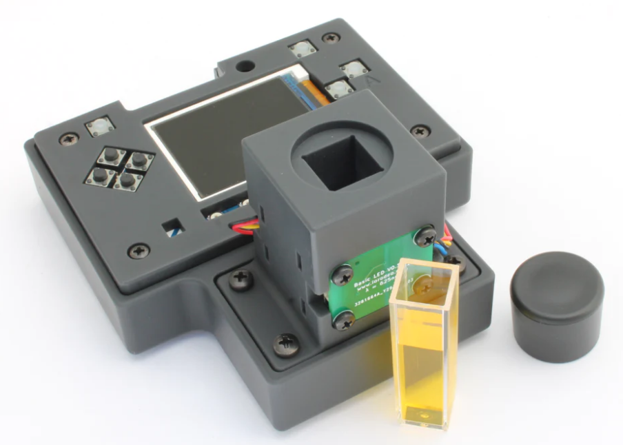

# 🎨 Open Colorimeter - Guía de Instalación y Configuración

Este repositorio contiene todos los archivos necesarios y una guía detallada para la instalación del **Open Colorimeter de IO Rodeo**, un dispositivo portátil de código abierto diseñado para realizar análisis colorimétricos con precisión, ideal para aplicaciones científicas, educativas y de laboratorio.

---

## 📸 Modelo del dispositivo

---

## 📦 Requisitos

### 🧰 Componentes de hardware

Asegúrate de contar con los siguientes componentes físicos para ensamblar y operar correctamente el colorímetro:

- ✅ **Adafruit PyBadge** (modelo original o LC)
- ✅ **Sensor TSL2591** (sensor de luz digital)
- ✅ Pantalla TFT (integrada en el PyBadge)
- ✅ Cable USB **de datos** (no solo carga)
- ✅ Carcasa impresa en 3D (opcional pero altamente recomendada)

---

### 💻 Archivos y software necesarios

| Archivo                                                   | Descripción                                      |
|-----------------------------------------------------------|--------------------------------------------------|
| `open_colorimeter_firmware_v0.1.1.zip`                    | Firmware principal del colorímetro               |
| `update-bootloader-arcade_pybadge-v3.14.0.uf2`            | Bootloader v3.14 para PyBadge                    |
| `adafruit-circuitpython-pybadge-en_US-7.3.2.uf2`          | CircuitPython v7.3.2 compatible con PyBadge      |
| Librerías de Adafruit                                     | Librerías necesarias para CircuitPython          |

---

## 🔧 Guía de instalación

### 📥 Paso 1: Instalar el firmware del colorímetro

1. Descarga el archivo [`open_colorimeter_firmware_v0.1.1.zip`](firmware/open_colorimeter_firmware_v0.1.1).
2. Extrae los archivos en tu computadora.
3. Conecta el PyBadge: debe aparecer una unidad llamada `CIRCUITPY`.
4. Elimina cualquier archivo anterior dentro de `CIRCUITPY`.
5. Copia todos los archivos extraídos directamente a la unidad `CIRCUITPY`.

---

## 🔁 Actualización del bootloader y CircuitPython

> ⚠️ Importante: Este paso es **obligatorio** si tu dispositivo no tiene las versiones requeridas. Solo es necesario hacerlo una vez, a menos que actualices el sistema en el futuro.

### 🛠️ Paso 2: Activar el modo bootloader

1. Conecta el PyBadge a tu computadora usando un **cable USB de datos**.
2. Presiona dos veces rápidamente el botón blanco `RESET`.
3. Verás que la pantalla cambia (color azul o verde) y aparece una nueva unidad: `BADGEBOOT` o `ARCADE`.

---

### 🧱 Paso 3: Instalar el Bootloader v3.14

1. Descarga [`update-bootloader-arcade_pybadge-v3.14.0.uf2`](bootloader/update-bootloader-arcade_pybadge-v3.14.0.uf2).
2. Arrastra el archivo `.uf2` a la unidad `BADGEBOOT`.
3. El dispositivo se reiniciará automáticamente.

---

### 🐍 Paso 4: Instalar CircuitPython 7.3.2

1. Si es necesario, vuelve a entrar en `BADGEBOOT` presionando `RESET` dos veces.
2. Descarga [`adafruit-circuitpython-pybadge-en_US-7.3.2.uf2`](circuitpython/adafruit-circuitpython-pybadge-en_US-7.3.2.uf2).
3. Copia el archivo `.uf2` a la unidad `BADGEBOOT`.
4. El dispositivo se reiniciará y aparecerá como `CIRCUITPY`.

---

## ✅ Paso 5: Verificar instalación

- Debes ver una unidad llamada `CIRCUITPY` en tu computadora.
- El firmware debe estar cargado y el colorímetro encenderá mostrando su interfaz.
- ¡Listo! Ya puedes usar tu **Open Colorimeter**.

---

## 📚 Créditos

Este proyecto se basa en el diseño de código abierto desarrollado por [IO Rodeo](https://iorodeo.com).  
Repositorio original: [https://github.com/iorodeo/colorimeter](https://github.com/iorodeo/colorimeter)

---

